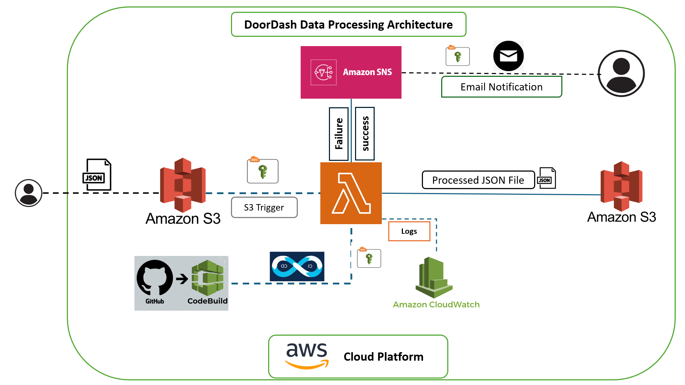

# DoorDash Delivery Data Processing

## Overview
This project automates the processing of daily delivery data from DoorDash using AWS services. JSON files containing delivery records are uploaded to an S3 bucket, triggering an AWS Lambda function to filter and process the data. Notifications are sent via Amazon SNS.

## Requirements
- AWS Account
- Amazon S3 buckets: `doordash-landing-zn` and `doordash-target-zn`
- AWS Lambda
- Amazon SNS
- AWS IAM (for permissions)
- AWS CodeBuild (for CI/CD)
- GitHub (for version control)
- Python, pandas library
- Email subscription for SNS notifications

## Steps

### 1. Sample JSON File for Daily Data
A sample JSON file named `2024-03-09-raw_input.json` with 10 delivery records will be used for testing.

### 2. Daily JSON Arrival in S3 Bucket
Daily JSON files will arrive in the S3 bucket `doordash-landing-zn` with a format like `yyyy-mm-dd-raw_input.json`.

### 3. Set Up S3 Buckets
Create two S3 buckets:
- `doordash-landing-zn` for incoming raw files
- `doordash-target-zn` for processed files

### 4. Set Up Amazon SNS Topic
- Create an SNS topic for sending processing notifications.
- Subscribe an email to the topic for receiving notifications.

### 5. Create IAM Role for Lambda
Create an IAM role with permissions to:
- Read from `doordash-landing-zn`
- Write to `doordash-target-zn`
- Publish messages to the SNS topic

### 6. Create and Configure AWS Lambda Function
- Create a Lambda function using Python runtime.
- Add the pandas library to the function's deployment package or use a Lambda Layer for pandas.
- Use the S3 trigger to invoke the function upon file uploads to `doordash-landing-zn`.
- The Lambda function should:
  - Read the JSON file into a pandas DataFrame.
  - Filter records where status is "delivered".
  - Write the filtered DataFrame to a new JSON file in `doordash-target-zn` using the specified format.
  - Publish a success or failure message to the SNS topic.

### 7. AWS CodeBuild for CI/CD
- Host your Lambda function code on GitHub.
- Set up an AWS CodeBuild project linked to your GitHub repository.
- Configure the `buildspec.yml` to automate deployment of your Lambda function code updates.

### 8. Testing and Verification
- Upload the sample JSON file to `doordash-landing-zn` and verify that the Lambda function triggers correctly.
- Check `doordash-target-zn` for the processed file and confirm its contents.
- Ensure an email notification is received upon processing completion.

